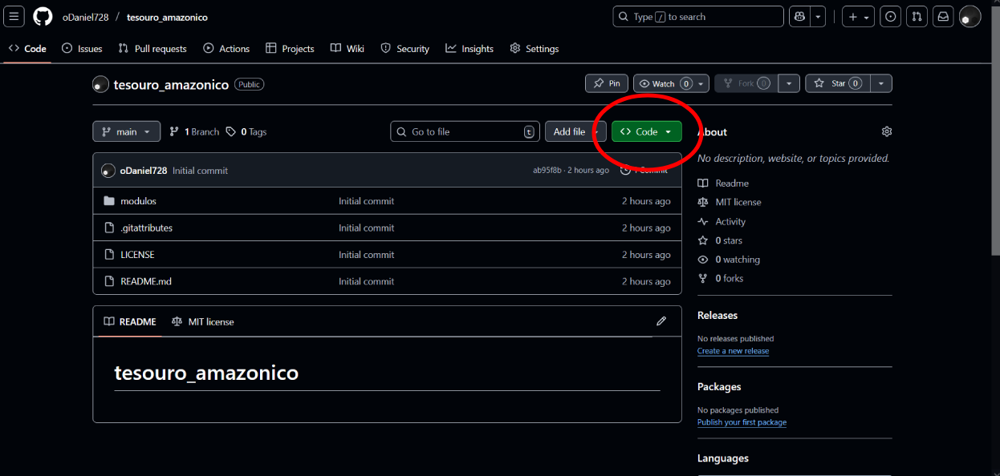
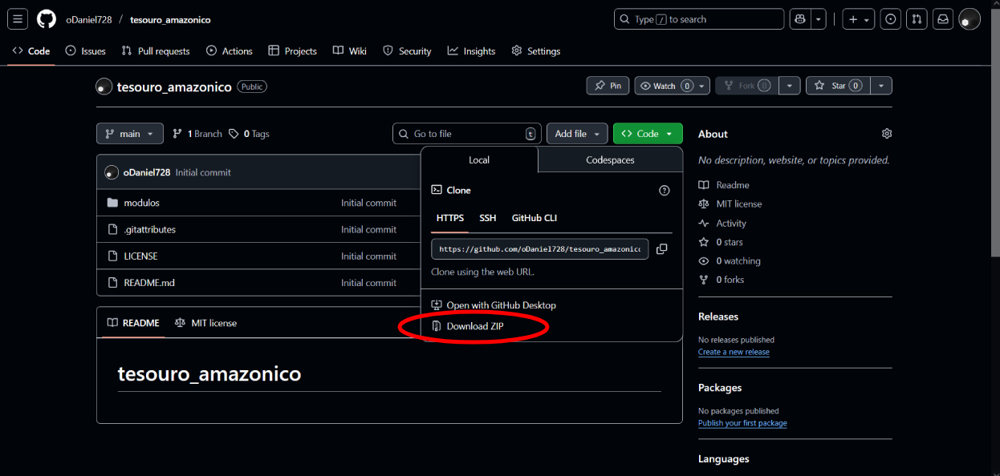

# Instalação

## Requisitos
- Python 3.12+
- Sistema operacional Windows/Linux

### Instalação por git
```bash
git clone https://github.com/usuario/meu_projeto.git
cd meu_projeto
```
### Instalação manual


Depois, extraia a pasta no seu projeto e delete o `src/`